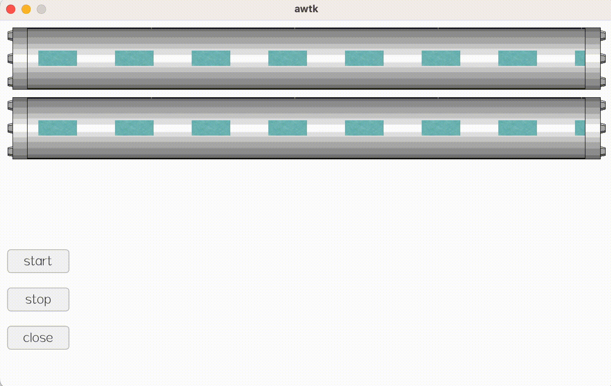

# awtk-widget-liquid_flow

液体流动效果控件。



主要特色：
----------------
* 支持水平和垂直。
* 支持正向和反向。
* 支持设置头尾的图片。
* 支持设置流动的图片。
* 支持设置速度的快慢。
* 支持启停操作。
  
## 准备

1. 获取 awtk 并编译

```
git clone https://github.com/zlgopen/awtk.git
cd awtk; scons; cd -
```

## 运行

1. 生成示例代码的资源

```
python scripts/update_res.py all
```

1. 编译

* 编译PC版本

```
scons
```

* 编译LINUX FB版本

```
scons LINUX_FB=true
```

> 完整编译选项请参考[编译选项](https://github.com/zlgopen/awtk-widget-generator/blob/master/docs/build_options.md)

3. 运行

```
./bin/demo
```

## 文档

[完善自定义控件](https://github.com/zlgopen/awtk-widget-generator/blob/master/docs/improve_generated_widget.md)
